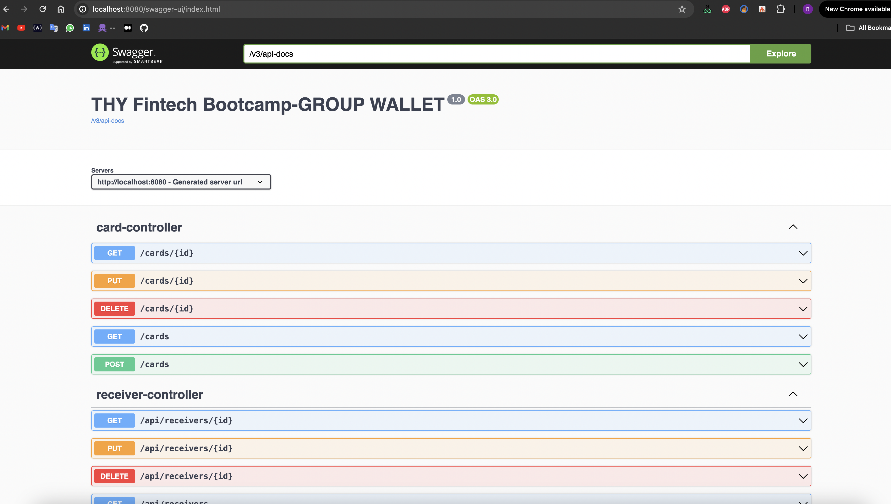

# THY FINTECH - BOOTCAMP


## Used Technologies & Architecture & Methods:

* Monolithic Architecture
* Java 17
* Spring Boot 3.2.5
* Postgres
* Swagger
* Maven
* Docker
* Logger

## DATABASE SCHEMA:

Created 9 entity for this study.


## SWAGGER

Swagger Implementation for API Documentation

``` 
    http://localhost:8086/swagger-ui/index.html#/
 
 ```

For JSON format:

```
    http://localhost:8086/v3/api-docs
    
```




## Docker

Docker Compose file contains 2 services. One for Postgres and the other one for Spring Boot Application.

Run the services using Docker Compose command:

     docker-compose up  


